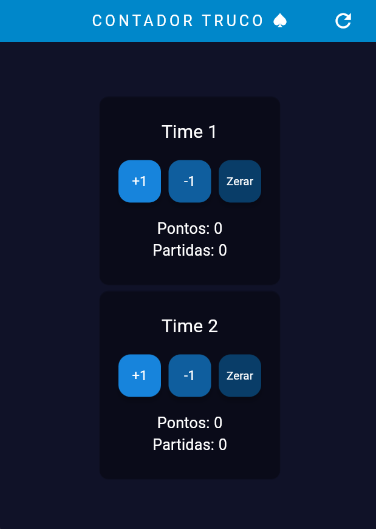

# 🎲 Contador de Truco

['images/desktop.png', 'images/mobile.png']

Um contador de pontos para jogos de truco desenvolvido com Flutter Web, oferecendo uma interface responsiva tanto para desktop quanto para dispositivos móveis. O projeto implementa conceitos de Programação Orientada a Objetos e widgets personalizados para melhor manutenibilidade do código.

---

## 📌 Funcionalidades principais
- Contagem de pontos para dois times
- Botões para somar e diminuir pontos
- Opção de zerar placar
- Iniciar novo jogo
- Interface adaptativa (desktop/mobile)

---

## 🎨 Destaques técnicos
- Desenvolvimento com **Flutter Web**
- Widget personalizado para placar (reusabilidade)
- Implementação de conceitos POO
- Design responsivo
- Estado gerenciado com SetState

---

## 🖥️ Versão Desktop
<div align="center">
  
</div>

## 📱 Versão Mobile
<div align="center">
  
</div>

---

## 🛠️ Tecnologias utilizadas
- Flutter
- Dart
- Git para versionamento
- GitHub Pages para deploy

---

## ⚙️ Como executar

1. **Pré-requisitos**
```bash
flutter --version  # Certifique-se de ter Flutter instalado
```

2. **Clone o repositório**
```bash
git clone <URL-do-seu-repo>
cd contador-truco
```

3. **Instale as dependências**
```bash
flutter pub get
```

4. **Execute o projeto**
```bash
flutter run -d chrome  # Para executar no navegador
```

---

## 📚 Estrutura do projeto
- `lib/`
  - `main.dart` - Ponto de entrada da aplicação
  - `placar.dart/` - Widget personalizado para o placar

